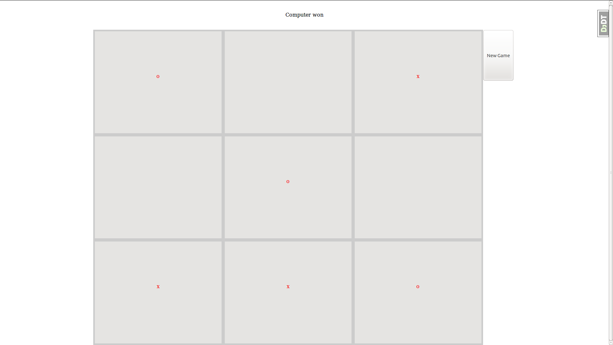

Installation
============
These first few steps may not be needed, if you have the dependencies working already. But in case you don't, here are some install instructions.

System Requirements
------------
You need to have pip installed!
If you don't have it, on Macs you should be able to do 
	brew install python

to get it. I can't be 100% sure that works, since I don't have a mac. On Ubuntu, it's

    sudo apt-get install python-pip

Next we make sure virtualenv and virtualenvwrapper are installed.

	sudo pip install virtualenv

	sudo pip install virtualenvwrapper

Again, the following may be optional for you

	mkdir ~/.virtualenvs 

	echo "export WORKON_HOME=~/.virtualenvs" >> ~/.bashrc

	echo "source /usr/local/bin/virtualenvwrapper.sh" >> ~/.bashrc 

	echo "export PIP_VIRTUALENV_BASE=~/.virtualenvs" >> ~/.bashrc 

	source ~/.bashrc 

You'll need to have a system mysql python adapter. Again, I don't have a Mac, so if you do, and you have trouble, this might be of help: http://james.lin.net.nz/2013/02/12/installing-python-mysql-adapter-on-mac-osx/

On Ubuntu we install these by either installing

	sudo apt-get install build-essential python-dev libmysqlclient-dev

That will give us system dependencies needed for the pip MySQL-Python package, or you can just make that unnecessary by installing the adapter through Ubuntu's repositories

	sudo apt-get install python-mysqldb

Application Requirements
--------------
Now we can get to the real stuff!! First you need to clone the repo.

	git clone git@github.com:jlegs/tacky-tic-tac-toe.git

Then, make your virtualenvironment and install the application's dependencies

	mkvirtualenv tacky

	pip install -r requirements.txt

enter your mysql prompt

	create database tacky;

	create user 'tacky'@'localhost' identified by 'tacky';

	grant all on tacky.* to 'tacky'@'localhost';

Now you should be ready to handle the migrations

	./manage.py syncdb

	./manage.py migrate

After a ./manage.py runserver, you should be ready to play!!

